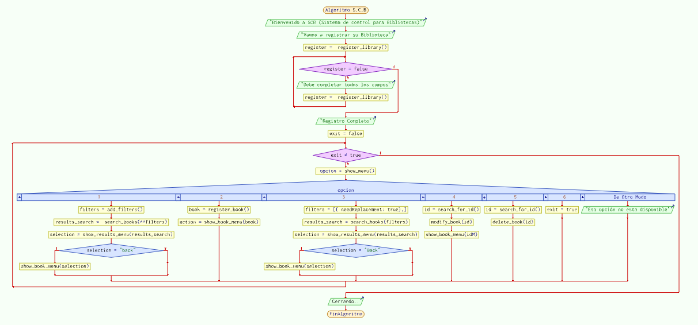

# Proyecto Integral N°2
El presente documento, es el **Proyecto Integral N°2** de la ***Tecnicatura Universitaria en Sistemas Informáticos*** del ***C.U.D.I***. 
- Materia: Programación 2 & Laboratorio 2
- Autores: Pablo Esteban Velazques Montiel, Martinez Marcos

# Necesidad a satisfacer:
A petición de muchos clientes en cuanto a su necesidad de poder controlar sus libros dentro de sus bibliotecas, permitiendoles ver libros disponibles o no disponibles (prestados) además necesitan facilitar el trabajo de recambio dependiendo de su estado y de la compra de libros para su stock. 

# Análisis y solución:
Hemos realizado un análisis de lo necesario dentro del programa (acciones posibles) a saber:
[1] Registrar biblioteca [2] Buscar libro [3] Ingresar Nuevo [4] Ver reposiciones necesarias [5] Modificar libro [6] ELiminar libro. Cada libro tendra un Identificador Único a pesar de tener libros repetidos. Se debe proporcionar el ID del libro al crearlo, junto a sus pertinentes datos, ya que se recomienda estampar de alguna manera en el libro físico.

#### Especificaciones
Esta solución informática sirve registrar los libros de una libreriría. Este programa fue diseñado y construido utilizando los concepto de Programación orientada a objetos, clase, Herencia, Funciones, Ciclos, Bucles, Entrada y control de datos, además, implementa buenas prácticas de programación.

#### Especificaciones técnicas
- Variable de guardado: allBooks
- Tipo de variable: Lista
- Tipo de variable libro: Objeto
- Interface: Terminal/Interprete de commando

#### Requerimientos
- Python v3.11.4
- GIT v2.40.1
- IDE - Visual Studio Code v1.78.2

#### Estructura del Programa
``` 
Registro
└──Petición-datos
    ├── Buscar-Libros
    │   └── Petición-datos
    │        └── Mostrar-resultados
    |             └── Mostrar-libro
    |                 ├── Modificar-libro
    |                 │   └── Petición-datos
    |                 │       └── Confirmar-modificación
    |                 └── Eliminar-libro
    |                     └── Confirmar-eliminación
    ├── Ingresar-libro
    │   └── Petición-datos
    │       └── Mostrar-libro
    |           ├── Modificar-libro
    |           │   └── Petición-datos
    |           │       └── Confirmar-modificación
    |           └── Eliminar-libro
    |               └── Confirmar-eliminación
    ├── Reposiciónes-Necesarias
    │   └── Mostrar-resultados
    |       └──  Mostrar-libro
    |           ├── Modificar-libro
    |           │   └── Petición-datos
    |           │       └── Confirmar-modificación
    |           └── Eliminar-libro
    |               └── Confirmar-eliminación
    ├── Modificar-libro
    │   └── Petición-datos
    │       └── Confirmar-modificación
    └── Eliminar-libro
    |    └── Petición-datos
    |        └── Confirmar-eliminación
    └── Salir
```

# Aclaraciones
Siempre que se termina un proceso con un libro se mostrará el libro a excepción del método Eliminar.   
---
### Diagrama de flujo función main



# Desarrollo de las pruebas de escritorio

**Prueba de escritorio : S.C.B.**
- Request:
  - Parámetros opcionales de :
    - categoria=Oficina  *(tipo: string. Trae los muebles de una misma categoría)* 
    - precio_gte=500.00  *(tipo: decimal. Trae los muebles que tienen un precio mayor o igual a $500)* 
    - precio_lte=400.00  *(tipo: decimal. Trae los muebles que tienen un precio menor o igual a $400)* 
- Respuesta:
    ``` 
    ```
  - 
  - 