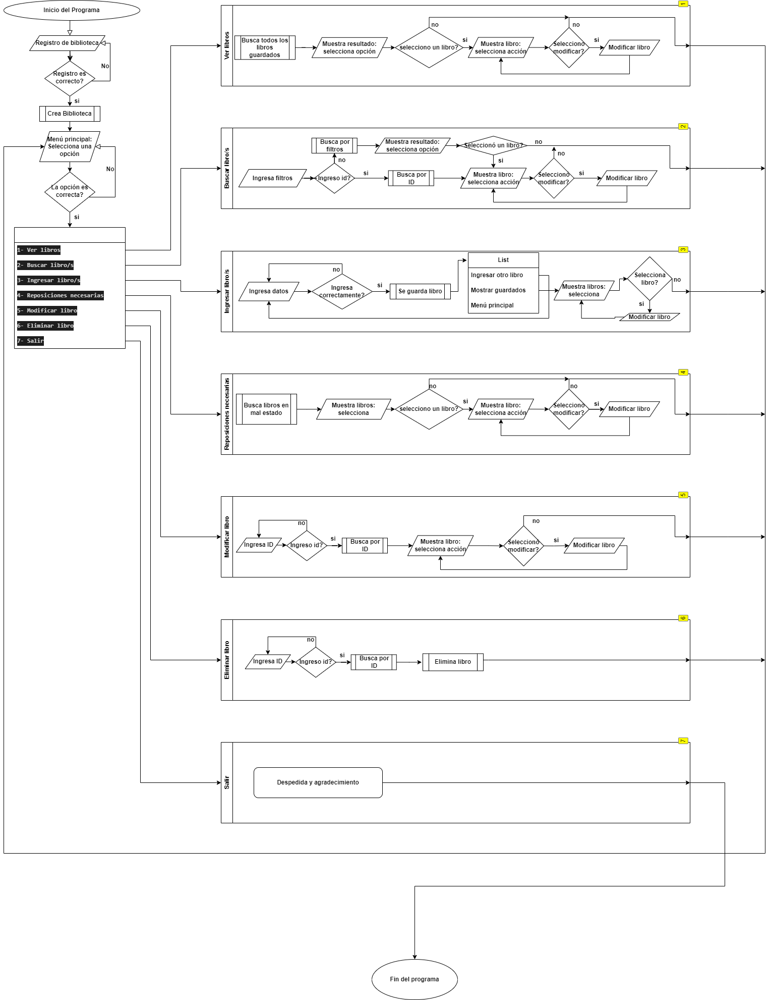

# Proyecto Integral N°2
El presente documento, es el **Proyecto Integral N°2** de la ***Tecnicatura Universitaria en Sistemas Informáticos*** del ***C.U.D.I***. 
- Materia: Programación 2 & Laboratorio 2
- Autores: Pablo Esteban Velasquez Montiel, Martinez Marcos

# Necesidad a satisfacer:
A petición de muchos clientes en cuanto a su necesidad de poder controlar sus libros dentro de sus bibliotecas, permitiendoles ver sus libros además de facilitar el trabajo de recambio dependiendo de su estado y de la compra de libros para su stock al ver que libros tienen por nombre o por autor.

# Análisis y solución:
Hemos realizado un análisis de lo necesario dentro del programa (acciones posibles) a saber:
[1] Registrar biblioteca 
[2] Buscar libro 
[3] Ingresar Nuevo 
[4] Ver reposiciones necesarias 
[5] Modificar libro 
[6] ELiminar libro. 
Cada libro tendra un Identificador Único a pesar de tener libros repetidos. Se debe proporcionar el ID del libro al crearlo, junto a sus pertinentes datos, ya que se recomienda estampar de alguna manera en el libro físico.

#### Especificaciones
Esta solución informática sirve registrar los libros de una libreriría. Este programa fue diseñado y construido utilizando los concepto de:
- Programación orientada a Objetos 
- Encapsulamiento 
- Clases 
- Funciones 
- Ciclos 
- Bucles
- Listas
- Entrada de datos y control de datos
- Implementación de buenas prácticas de programación.

#### Especificaciones técnicas
- Variables de guardado:
  - your_library = Datos de la biblioteca
  - your_library_books = Libros de esa biblioteca
- Tipo de variable your_library: Class
- Tipo de variable your_library_books: List
- Interface: Terminal/Interprete de commando

#### Requerimientos
- Python v3.11.4
- GIT v2.40.1
- IDE - Visual Studio Code v1.78.2

#### Estructura del Programa
``` 
Registro de biblioteca
└──Petición-datos
    └──Ingreso al menú
        ├── Buscar-Libros
        │   └── Petición-datos
        │        └── Mostrar-resultados
        |             └── Mostrar-libro
        |                 └── Modificar-libro
        |                     └── Petición-datos
        ├── Ingresar-libro
        │   └── Petición-datos
        │       └── Mostrar-libro
        |           └── Modificar-libro
        |               └── Petición-datos
        ├── Reposiciónes-Necesarias
        │   └── Mostrar-resultados
        |       └──  Mostrar-libro
        |           └── Modificar-libro
        |               └── Petición-datos
        ├── Modificar-libro
        │   └── Petición-datos
        └── Eliminar-libro
        |    └── Petición-datos
        └── Salir
```

# Aclaraciones
Siempre que se termina un proceso con un libro se mostrará el libro a excepción del método Eliminar.   
---
### Diagrama de flujo del programa



# Desarrollo de las pruebas de escritorio

**Prueba de escritorio : S.C.B.**
- :
  - Parámetros :
    - 
    - 
    - 
- :
    ``` 
    ```
  - 
  - 
